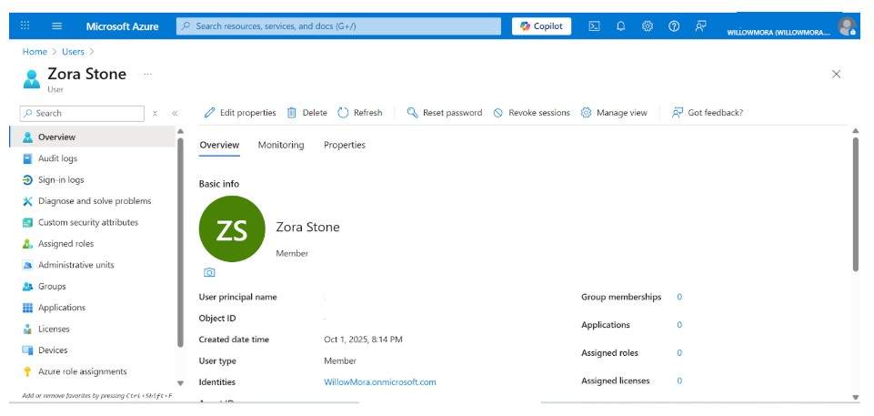

# Lab 02 – User Provisioning & Application Assignment

**Date Completed:** 10/01/2025  
**Tools Used:** Microsoft Entra ID, Azure Portal  
**Role Focus:** Identity & Access Management (IAM)  

---

## Overview
User provisioning is a foundational responsibility of identity and access management teams.  
In this lab, I created a fictional employee account in my **WillowMora** Entra ID tenant and assigned that user access to an enterprise application.

This lab demonstrates how identity administrators control **who gets access**, **to what**, and **how access is validated**.

---

## Step 1 – Create a New User Account
To simulate a real employee onboarding scenario, I created a new user account named **Zora Stone** within the WillowMora tenant.

- Created the user under the WillowMora domain
- Assigned a **temporary password**
- Required password change at first login
- Verified user object details and account status

This user serves as a test identity for future IAM policies and security controls.

### Evidence

---

## Step 2 – Assign Enterprise Application Access
To demonstrate application-level access control, I assigned Zora Stone access to a test enterprise application.

- Navigated to **Enterprise Applications**
- Selected **Microsoft Entra SAML Toolkit**
- Assigned Zora Stone as an authorized user
- Verified the assignment was successful

This simulates how organizations grant employees access to business applications using identity-based controls.

### Evidence

---

## Key IAM Concepts Demonstrated
- User provisioning and identity creation
- Secure onboarding with temporary credentials
- Application access management
- Visibility and verification of user assignments
- Foundations for Single Sign-On (SSO)

---

## Why This Matters
In enterprise environments, identity teams rarely grant blanket access.  
Each user is provisioned deliberately and assigned only the applications they need.

This lab demonstrates:
- How identities are created and validated
- How application access is controlled at the identity layer
- How IAM supports security, governance, and auditability
