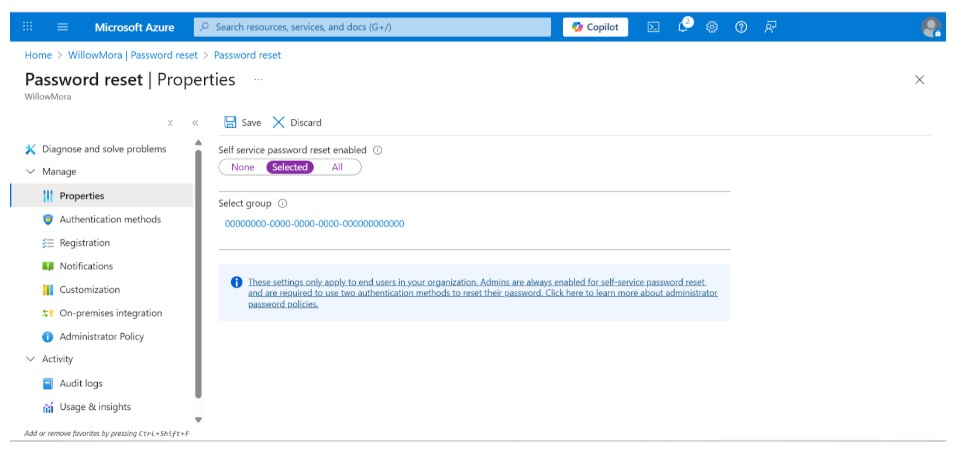
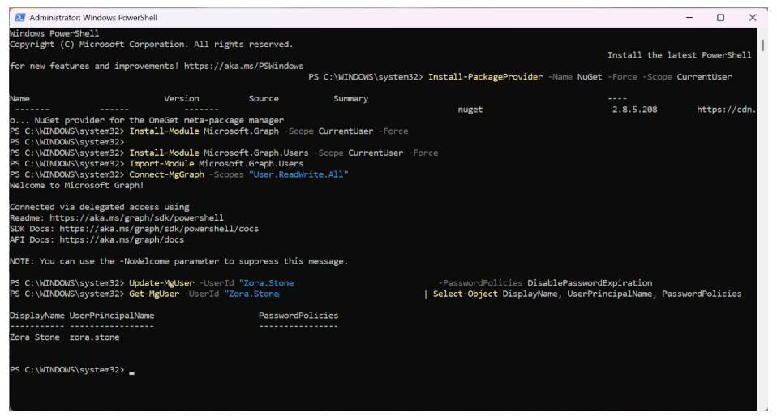

# Lab 03 – Self-Service Password Reset (SSPR)

**Date Completed:** 10/01/2025  
**Tools Used:** Microsoft Entra ID, Azure Portal, Microsoft Graph PowerShell  
**Role Focus:** Cloud Security / Identity & Access Management  

---

## Overview
Password resets are one of the most common user support requests in enterprise environments.  
In this lab, I configured **Self-Service Password Reset (SSPR)** in Microsoft Entra ID for my fictional company **WillowMora** and tested the full end-user experience using my test account, **Zora Stone**.

This lab demonstrates how organizations reduce helpdesk workload while enforcing secure identity practices.

---

## Step 1 – Configure SSPR for Selected Users
To safely test the feature, I enabled SSPR for **Selected users only** instead of all users.

- Navigated to **Microsoft Entra ID → Password reset**
- Set Self-service password reset to **Selected**
- Prepared the environment to test the reset flow with Zora Stone

### Evidence

---

## Step 2 – Admin-Initiated Password Reset
To simulate a real-world scenario, I reset Zora’s password as an administrator.

- Generated a **temporary password**
- Forced a password change at next sign-in
- Simulated an expired/temporary credential scenario

### Evidence

---

## Step 3 – End-User Password Update Flow
When Zora attempted to sign in with the temporary password, she was immediately prompted to update it.

This confirms that SSPR integrates directly with login enforcement policies.

### Evidence

---

## Step 4 – Successful Login After Password Reset
After updating her password, Zora successfully accessed her account.

This validates that the SSPR configuration worked end-to-end.

### Evidence

---

## Step 5 – Password Policy Update via Microsoft Graph
To demonstrate identity automation at scale, I used **Microsoft Graph PowerShell** to disable password expiration for Zora’s account.

This mirrors real-world scenarios where admins manage identity policies programmatically.

### Evidence

---

## Key Skills Demonstrated
- Self-Service Password Reset (SSPR) configuration
- Secure user onboarding and credential enforcement
- Identity lifecycle management
- Microsoft Graph PowerShell automation
- Reducing helpdesk dependency through IAM design

---

## Why This Matters
In enterprise environments, SSPR reduces operational overhead while improving user experience.  
This lab demonstrates both the **administrator configuration** and the **end-user experience**, which is critical for troubleshooting and secure identity design.
