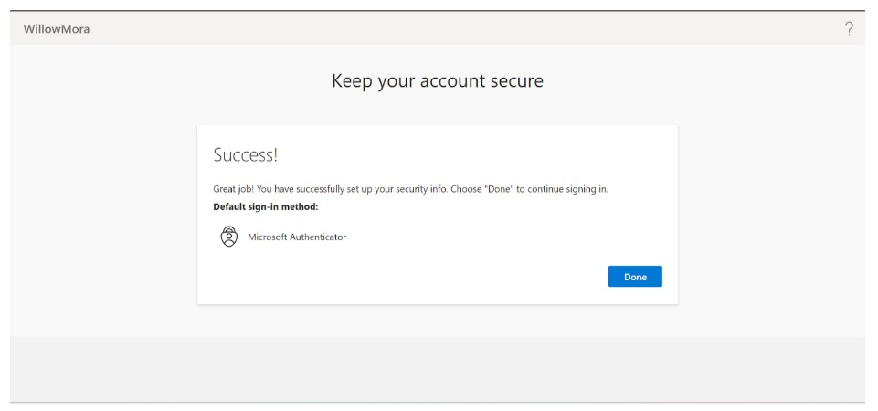

# Lab 04 – Conditional Access & MFA Enforcement

**Tenant:** WillowMora  
**Test User:** Zora Stone  
**Application:** Microsoft Entra SAML Toolkit  
**Tools Used:** Azure Entra ID  
**Date Completed:** 10/04/2025  

---

## Objective
Strengthen authentication by enforcing Multi-Factor Authentication (MFA) using Conditional Access for a specific user and application.

---

## Step 1: Create Conditional Access Policy
I navigated to **Entra ID → Security → Conditional Access → New Policy** and created a policy with the following settings:
- **User:** Zora Stone  
- **Application:** Microsoft Entra SAML Toolkit  
- **Grant Control:** Require MFA  
- **Policy Mode:** Report-only (initial), then switched to On  
- **Security Defaults:** Disabled to allow Conditional Access policies  

### Evidence
  

---

## Step 2: MFA Prompt During Login
When Zora signed in from an incognito browser, Conditional Access enforced MFA.  
She was blocked from access until she completed MFA registration.

### Evidence
  

---

## Step 3: Verify Enforcement in Sign-In Logs
To confirm enforcement, I reviewed **Entra ID → Sign-in logs** and filtered for Zora’s activity.  
The Conditional Access tab showed the policy applied with **Result = Success**.

### Evidence

---

## Key Learnings
- Security Defaults must be disabled to use Conditional Access  
- MFA can be scoped to specific users and applications  
- Sign-in logs provide validation that policies are enforced  
- Conditional Access is a core control for protecting sensitive resources  

This lab demonstrates how organizations enforce modern authentication and verify compliance through logging.
