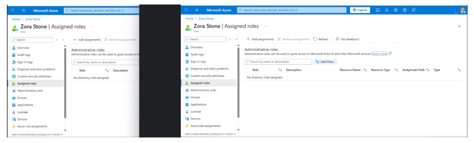
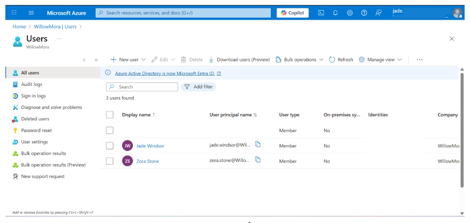
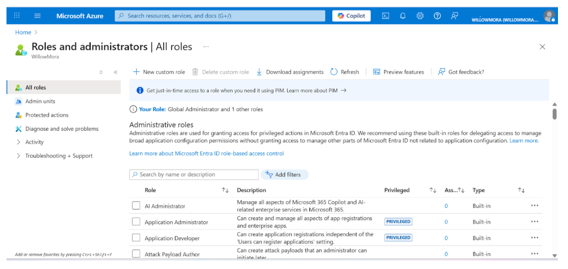
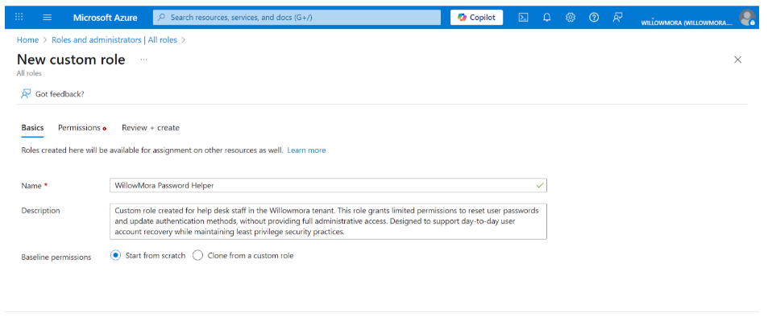
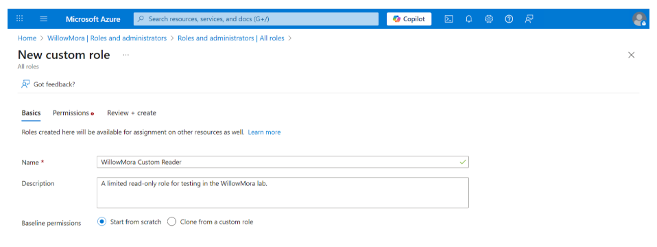
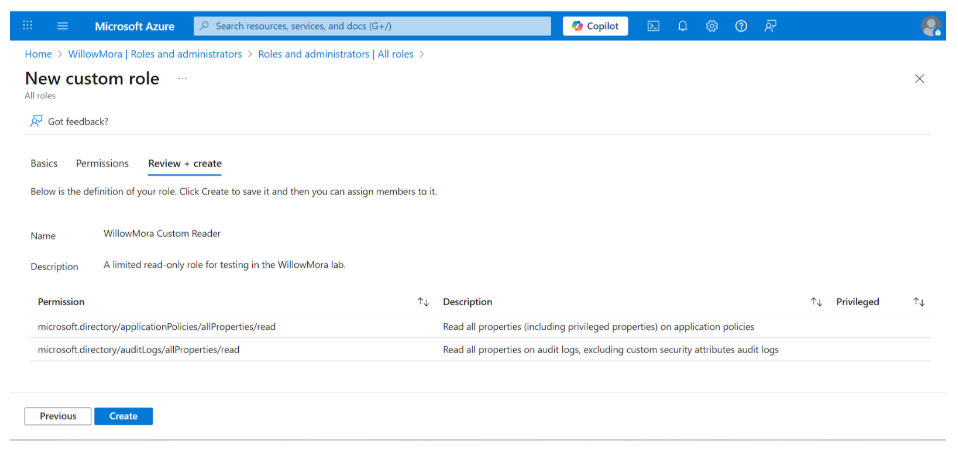
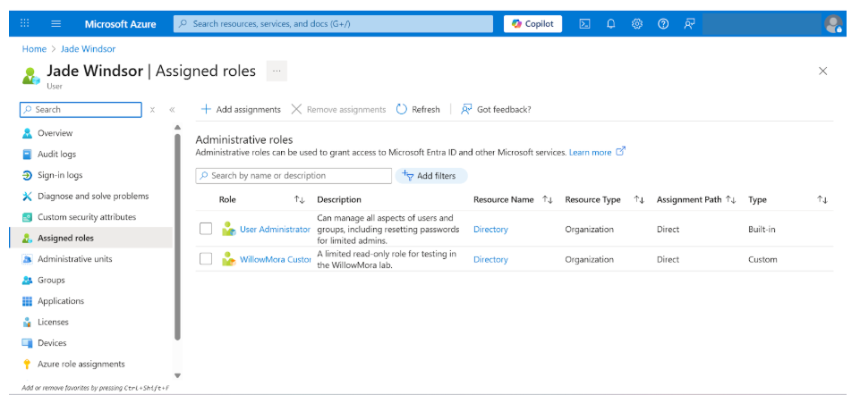

# Lab 05 — Role-Based Access Control (RBAC) & Custom Roles in Microsoft Entra ID

**Tenant:** WillowMora  
**Lab Focus:** Role-Based Access Control (RBAC), Least Privilege, Delegated Administration  
**Users:** Zora Stone, Jade Windsor  
**Tools Used:** Microsoft Entra ID (Azure AD), Azure Portal  

---

## Objective

Demonstrate how Role-Based Access Control (RBAC) enforces **least privilege** by:
- Assigning built-in roles to users
- Comparing access between users with different roles
- Creating and assigning **custom roles** for delegated administration

This lab simulates how enterprises safely delegate identity and security responsibilities without granting Global Administrator access.

---

## Step 1 — Create a Second User (Jade Windsor)

I created **Jade Windsor** as a second user in the WillowMora tenant with the job title **HR Analyst**.  
This user represents a staff member who needs limited visibility into security data but should not modify tenant-wide settings.

### Evidence

---

## Step 2 — Assign Built-In Security Reader Role

I assigned **Jade Windsor** the **Security Reader** role.

The Security Reader role allows read-only access to:
- Sign-in logs
- Security reports
- Security-related configuration visibility  

This role **does not allow changes**, which demonstrates least privilege in action.

### Evidence

---

## Step 3 — RBAC Comparison: Zora vs. Jade

To clearly demonstrate RBAC enforcement, I compared both users:

- **Zora Stone**
  - Standard user
  - No administrative or security roles
  - Access limited to her own account

- **Jade Windsor**
  - Assigned Security Reader
  - Can view security data tenant-wide
  - Cannot modify users, roles, or Conditional Access

### Evidence

---

## Step 4 — Testing RBAC by Logging in as Jade

I logged into the Azure portal as **Jade Windsor** to validate her permissions.

**Observed behavior:**
- Jade could view users and sign-in logs
- The **Conditional Access** blade was **disabled/blurred**
- Policy configuration options were unavailable

This confirms RBAC enforcement at the permission and UI level.

### Evidence

---

## Step 5 — Exploring Roles & Administrators

Before creating a custom role, I reviewed built-in directory roles by navigating to:

**Microsoft Entra ID → Roles and administrators**

This page lists built-in roles such as:
- Global Administrator
- Security Reader
- User Administrator

It is also the entry point for creating **custom roles**.

### Evidence

---

## Step 6 — Create a Custom Role (WillowMora Password Helper)

To demonstrate fine-grained RBAC, I created a **custom role** designed for help desk staff.

**Role details:**
- **Name:** WillowMora Password Helper  
- **Purpose:** Reset passwords and manage authentication methods  
- **Scope:** No global administrative privileges  

### Evidence

---

## Step 7 — Add Permissions to Custom Role

I assigned limited permissions to the custom role, including:
- `Directory.Read.All`
- `AuditLog.Read.All` (optional)

These permissions allow visibility without administrative control.

### Evidence

---

## Step 8 — Review & Create Custom Role

I reviewed the role configuration and completed creation.

### Evidence

---

## Step 9 — Assign Custom Role to Jade Windsor

I assigned the **WillowMora custom role** to Jade Windsor.

This demonstrates how **multiple roles** can be combined safely:
- Delegated administration
- Read-only directory access

### Evidence

---

## Step 10 — Validate Custom Role Permissions

After logging in as Jade again:
- She could view users and directory data
- She could perform delegated tasks
- She **still could not** modify Conditional Access or security policies

This confirms correct RBAC scoping.

### Evidence

---

## Key Learning Outcomes

- RBAC enforces **least privilege**
- Security Reader enables visibility without risk
- Custom roles allow precise delegation
- Conditional Access remains protected
- Compromised low-privilege accounts cannot weaken security controls

---

## Lab Summary

With **Zora Stone** and **Jade Windsor**, this lab demonstrates:
- Role-based access control
- Delegated administration
- Custom role design
- Least privilege enforcement

Together with previous labs, this completes a strong **Identity & Access Management (IAM)** portfolio covering:
- Password policies
- Self-Service Password Reset (SSPR)
- Conditional Access + MFA
- RBAC + Custom Roles
