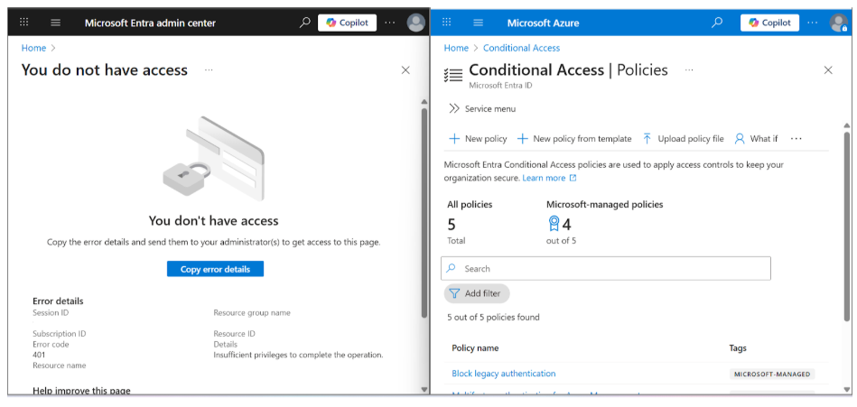

# Lab 06 — Least Privilege Enforcement with Jade Windsor

## Goal
Demonstrate the principle of least privilege by showing what a delegated User Administrator can and cannot do in Microsoft Entra ID.

---

## Step 1 — Log in as Jade Windsor

I logged into the Azure portal as **Jade Windsor**, who holds the **User Administrator** role in the Willowmora tenant.

This role allows user and password management but does not grant access to security policy configuration.

---

## Step 2 — Validate Allowed Actions

Jade navigated to:
**Entra ID → Users → Zora Stone**

She was able to:
- View user profiles
- Reset passwords

This confirms delegated user management permissions.

---

## Step 3 — Perform Allowed Action

Jade successfully reset Zora Stone’s password.

This simulates a real-world help desk or IT support task without requiring Global Administrator access.

📸 Screenshot:

---

## Step 4 — Attempt Restricted Action

Jade attempted to access **Conditional Access** and create a new policy.

Result:
- Access denied
- Policy creation blocked

📸 Screenshot:

This confirms that User Administrator permissions do not extend to security policy management.

---

## Reflection — Least Privilege in Action

- **Zora**: Standard employee, subject to security controls
- **Jade**: Delegated administrator, limited to user lifecycle tasks
- **Global Admin**: Required for security policy configuration

📸 Screenshot:

---

## Learning Outcome

RBAC ensures users receive **only the permissions required** to perform their job functions.

Delegated roles:
- Reduce insider risk
- Limit damage from compromised accounts
- Improve operational efficiency

---

## Wrap-Up

This lab completes the RBAC story by validating role boundaries through real testing. Azure Entra ID enables scalable governance by enforcing least privilege without slowing down IT operations.
