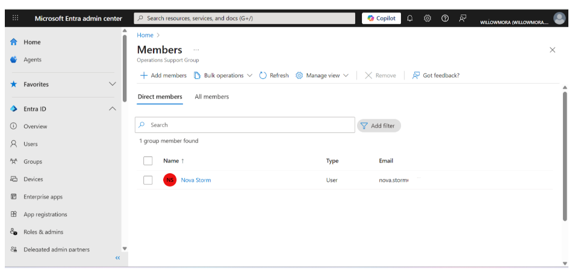
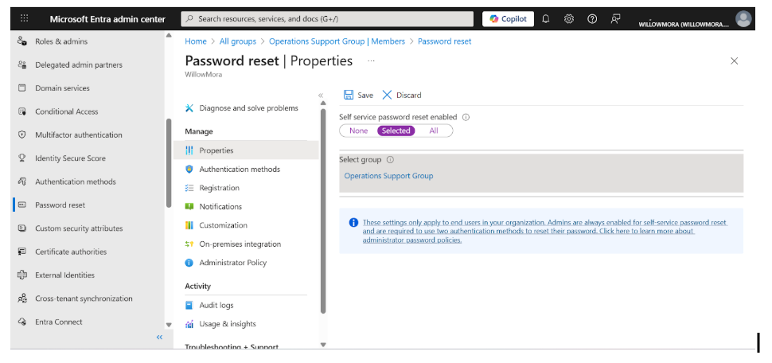
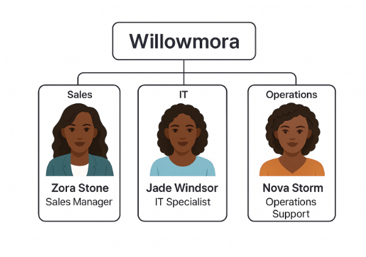

# Lab 08 — Configure Identity & Access Policies (IAM)

**Tenant:** Willowmora  
**Focus:** Identity & Access Management (IAM)  
**Technologies:** Microsoft Entra ID, RBAC, Groups, SSPR, Administrative Units  

---

##  Objective

Demonstrate how to configure identity and access management (IAM) controls within Microsoft Entra ID to:

- Secure user accounts
- Delegate administrative responsibilities
- Enforce least privilege
- Reduce reliance on Global Administrator roles

This lab focuses on **group-based access control**, **self-service password reset (SSPR)**, and **scoped administrative delegation** using Administrative Units (AUs).

---

## Step 1: Create Operations Support Group

**Purpose:**  
Establish a dedicated security group to manage users who will have access to password management and delegated administrative controls.

**Actions Performed:**
- Navigated to **Microsoft Entra ID → Groups → New Group**
- Created a **Security Group** named **Operations Support Group**
- Added **Nova Storm** as a member

**Why this matters:**  
Groups provide scalable, centralized access control. Assigning permissions to groups instead of individual users reduces configuration errors and improves security governance.

 **Evidence:** Operations Support Group with Nova Storm as a member  

---

## Step 2: Configure Self-Service Password Reset (SSPR) for Selected Users

**Purpose:**  
Allow users to securely reset their own passwords while maintaining organizational control.

**Actions Performed:**
- Navigated to **Entra ID → Password Reset → Properties**
- Set **Self-service password reset** to **Selected**
- Assigned the policy to **Operations Support Group**

**Why this matters:**  
Limiting SSPR to a pilot group allows testing and validation before tenant-wide rollout, reducing risk while improving user experience.

 **Evidence:** SSPR enabled for selected group  

---

## Step 3: Assign Password Administrator Role

**Purpose:**  
Delegate password reset privileges without granting full administrative access.

**Actions Performed:**
- Assigned the **Password Administrator** role to the **Operations Support Group**

**Why this matters:**  
This demonstrates **Role-Based Access Control (RBAC)** by granting narrowly scoped permissions instead of broad Global Admin rights.

 **Evidence:** Password Administrator role assigned  

---

## Step 4: Create Administrative Unit for Scoped Delegation

**Purpose:**  
Limit administrative permissions to a specific organizational scope.

**Actions Performed:**
- Conceptually created an **Administrative Unit** named **Operations Unit**
- Added **Nova Storm** and **Operations Support Group** as members
- Assigned **Password Administrator** role at the AU level

**Why this matters:**  
Administrative Units enforce **least privilege** by preventing tenant-wide administrative access and supporting separation of duties.

 **Evidence:** Administrative Unit configuration  

---

## Step 5: Review & Validation

After configuration, I verified that:

- Nova Storm could perform only delegated password management tasks
- Group-based role assignments applied correctly
- No tenant-wide administrative permissions were granted
- IAM controls aligned with enterprise security best practices

---

##  Key Learning Outcomes

- Implemented **group-based access control**
- Configured **Self-Service Password Reset (SSPR)**
- Delegated administrative permissions using **RBAC**
- Applied **Administrative Units** for scoped governance
- Reduced security risk by minimizing Global Admin usage

---

##  Portfolio Summary

This lab demonstrates practical implementation of Microsoft Entra ID identity and access management controls, including:

- Secure delegation of administrative responsibilities
- Enforcement of least privilege principles
- Group-based role management
- Identity governance through scoped access

Together with previous labs, this completes the **Willowmora IAM module**, showcasing real-world enterprise identity design and security practices.
