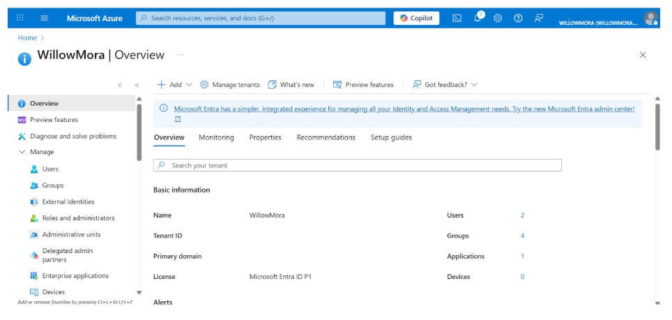

# Azure Cloud Labs Portfolio

**Description:** Hands-on Azure labs demonstrating identity and access management, networking, and security administration skills.

## Skills Demonstrated
- Microsoft Entra ID (Azure AD)
- RBAC (Role-Based Access Control)
- Network Security Groups (NSGs)
- Virtual Networks (VNets)
- IAM administration
- Logging & monitoring

## Labs in this Repository
- **Lab 1:** Entra ID Tenant Setup
- **Lab 2:** User Provisioning & Application Access 
- **Lab 3:** VM & Bastion Access  
- **Lab 4:** IAM Roles & Permissions

## Lab 01 – Entra ID Tenant Overview

Built a dedicated Microsoft Entra ID tenant to simulate an enterprise IAM environment.

## Lab 02 – User Provisioning & Application Access

Demonstrates identity lifecycle management and application access control using Microsoft Entra ID.

## Links
- **LinkedIn:** https://www.linkedin.com/in/billyeboddie

